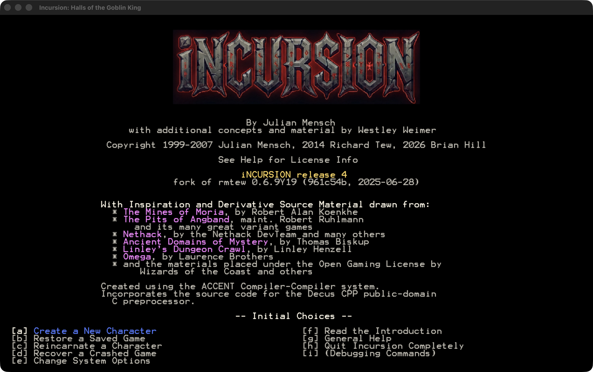

# iNCURSION

Julian Mensch's D&D 3.5 roguelike, running natively on the Mac.

Incursion is one of the deepest roguelikes ever written. Not a game with a few
D&D words borrowed for flavour — a real, implemented 3.5 ruleset, with feats that
combine, classes that branch into prestige paths, and a tactical combat model
that pays you back for every rule you actually know. The magic is not even
straight 3.5: Mensch threw out the SRD's eight schools and wrote his own eleven,
Arcana and Thaumaturgy and Weavecraft among them. He built something enormous and
then very nearly finished it.

It has only ever run on Windows. This fork brings it to macOS, and it is meant to
be played, not built.



**Jump to:** [Get it](#get-it) · [What is new](#what-is-new) ·
[What is fixed](#what-is-fixed) · [What is next](#what-is-next) ·
[Build from source](#building-from-source) · [For developers](#for-developers)

---

## Get it

Download the disk image from
[Releases](https://github.com/networkingguru/incursion-roguelike/releases), open
it, drag **Incursion.app** to Applications, and double-click it.

There is no installer, no dependency to fetch, and no compiler. The app is signed
and notarised by Apple, and the notarisation ticket is stapled to the app itself
rather than only to the disk image, so it still launches after you drag it out of
the image.

macOS asks once whether you are sure you want to open an app downloaded from the
Internet, and then never again. That prompt is normal: it is macOS asking for
consent, and every notarised app gets it on first launch. Two other messages are
not normal, and mean something is genuinely wrong — *"the developer cannot be
verified"* and *"the app has been modified or damaged"*. If you see either,
please open an issue.

**Requires** macOS on Apple Silicon. Intel and Linux builds are planned; see
*What is next*.

Your saves, options and logs live in `~/Library/Application Support/Incursion/`.
Deleting the app leaves them alone; delete that folder as well for a clean sweep.
They are kept outside the app because an app bundle that writes inside itself
breaks its own code signature, which macOS then reports as the app having been
modified or damaged.

**Three ways to run it.** The download is the windowed SDL build, which is the
way to play. Building from source also gives you a plain terminal build that
needs no graphics at all and works over ssh, and a headless mode that plays from
a script, which is how this fork finds its own bugs.

---

## What playing it is like

You roll a character through a long, gloriously opinionated creation flow — race,
subrace, class, attributes, alignment, feats, skills, a god — and then you go
down into the Halls of the Goblin King. Combat is turn-based and genuinely
tactical. Positioning matters. Attacks of opportunity matter. Two-weapon
fighting, spell components and saving throws all matter, and the game will
happily kill you for ignoring any of them. Play it like a hack-and-slash and it
will teach you otherwise in about ten minutes.

The writing is the other half of it. Every monster, item, spell and class carries
its own description inside the game — not a stat line, a paragraph with a voice.
You can read the entire ruleset from inside the game, and it is worth reading.

What works today: character creation, exploration, the full combat model, magic,
shops, saving and loading. The game compiles its own ruleset into a data module
at build time, so what you are playing is the whole of Mensch's game and not a
subset of it.

---

## What is new

The newest work is first. The top section describes work that is finished but
not yet in any download. Everything from **release 3** downward is in the
current download.

### In the current build (not yet released)

**Every Item member is set before it is read.** The item constructor worked out a
new item's hit points from two of its fields — its enchantment id and its plus —
before it assigned either one, and it never assigned five more members at all. It
leaned on the zero-fill that object allocation happens to leave behind. clang
keeps that fill, so the macOS build was never wrong. A GCC build at `-O2` does not
keep it, and there a garbage plus tripped an assertion and a wild parent handle
crashed character creation before the first map ever drew. The constructor now
sets each member before anything reads it, which is the same zero clang already
produced, so the macOS build is unchanged.

**The game builds and runs on Linux.** Six places in the port assumed Apple's
compiler or Apple's C library: a hardcoded `clang`, a shim header that shadowed
glibc's own, three missing standard includes, a clang-only debug trap, and one
double `fclose` the parent project's preprocessor has always carried. None of the
six was visible from macOS, and all six surfaced by building inside a Debian 11
(bullseye) container — glibc 2.31 on x86-64, chosen as an old-glibc floor so the
binary's versioned symbols resolve on newer distributions too. Both backends now
compile there under either clang or GCC, and a seeded session plays through with
no errors. This is the groundwork for the Linux and
Steam Deck target named under [What is next](#what-is-next), not a download yet
— but you can [build and run it from source](#building-from-source) today.

**Magic items now do what their own descriptions promise.** Item after item did
less than the text the game already shows for it. The Bloodspear named a bane
creature and wielder bonuses its script never granted; the Sunblade promised cold
resistance, a sixty-foot burst of light and double damage against Negative-Plane
creatures it never delivered; the Dwarven Thrower called itself a throwing hammer
while its base weapon could not be thrown at all; the Holy Avenger dispelled magic
at a fixed level rather than its paladin wielder's; and a god's holy symbol would
not stay out of the autopickup pile. More than twenty items across the Bloodspears,
Sunblades, Staffs, Cloaks, Bracers, Wands, Rods and scrolls were brought into line
with the one standard the game already sets for each — the description it displays.

### New in release 3

**Your save survives new content.** Every reference to game content inside a save
used to be a bare number, and that number was a position in a list. The lists sit
end to end in one numbering space, so adding a single monster, spell or effect
anywhere shifted every entry after it, and an existing save then read one
resource off — an orc came back as a lizardfolk, worshipping the wrong god. A
save now carries a manifest: the length of each of the 21 lists and every entry's
name in position order. The reader converts each reference through that manifest
instead of trusting the number, so content added to the end of a list changes
nothing about a save written before it.

**Old saves convert themselves.** Release 3 is deliberately content-identical to
release 2, so a release-2 save loads correctly and is rewritten in the new format
the first time you save. There is no command to run and nothing to click.
**Upgrade through release 3 rather than skipping it** — it is the release that
performs the conversion, and a save that never passes through it will read one
resource off once later content is added.

**A refused save no longer costs you your file.** The engine now checks whether a
save can be written before it touches anything on disk. A refusal leaves the
existing save exactly as it was, instead of a truncated file and a backup.

**A resource inserted in the middle of a list is refused, not guessed at.** If a
future release ever breaks the append-only rule, the load stops and names what
moved, down to the list, the position and both names, rather than silently
handing you different equipment.

**Saves are a fifth of the size.** Tagged records replaced raw structure dumps: a
2.4 MB character file became 360 KB.

### New in release 2

**The game no longer dies at the bottom of a dungeon.** Moving down from the
deepest level dereferenced a null dungeon, on all four routes that reach it:
falling into a chasm there, the plain `>` climb, levitating down, and a scripted
move. The climb needs no wizard mode and no script. Two more crashes went with
it — a hiding monster that could delete itself mid-spell and leave the caller
holding a dangling map pointer, and a room-building rectangle that inverted
itself in a narrow space and put doors in solid rock.

**The target cursor follows a ring, not an axis.** Arrow keys in target mode
scored candidates on one axis only, so RIGHT meant "the nearest column to my
right" and every row in that column tied. The cursor moved sideways while going
up, skipped near creatures for far ones, and reached places from which most
presses did nothing. Candidates now form a ring around you ordered by bearing,
and an arrow steps one place round it. Which things are candidates is unchanged.

**The shop list scrolls.** The store menu never scrolled at all: its redraw
cleared the scroll offset before every draw, so the selection walked off the page
and stayed there. It also read a hardcoded 32 visible rows instead of asking the
window, and its two manual-scroll keys worked only if you had opened the
inventory screen earlier in the same session.

**`<` and `>` work on the overview map, and find the nearest staircase.** Both
keys used to close the map instead of doing anything. The search behind them also
took the next staircase in reading order rather than the near one; each remembered
staircase is now ranked by what it costs to walk there, so the square the cursor
lands on is the square `R` will really reach. Repeated presses step down the
ranked list and wrap.

**Read a save without loading the game.** Point the binary at a save file with
`-dump` and it prints a full character report to the terminal, then exits. No
window opens and nothing is written. See
[Reading a save](#reading-a-save-without-loading-the-game) below.

**A failed save leaves the game standing.** Saving converted every object's
internal pointers to handles and converted them back afterwards. Any failure
part-way skipped the conversion back, and the game then crashed on the way out.
The report now reaches you and play continues. A file the game refuses to load no
longer takes the process with it either — that fix is a hand-port of Eugene
Archibald's work, and the root cause and evidence are his.

**Natural Weapon Speed, a new option.** Every weapon carries a speed rating;
unarmed and natural attacks carried none, so a monk punched at 100% while the
nunchaku in his pack struck at 160%. The option floors a weapon-capable
creature's brawl speed at the fastest weapon in the data. Dragons and oozes are
untouched and keep their own speeds. This is a balance change rather than a
defect fix, so it is a switch: fresh installs get FLOORED, and an existing
`Options.Dat` reads ORIGINAL until you flip it once.

**Twenty prestige-class descriptions are now true.** Each was a place where a
class promised something its own script never did. The Twilight Huntsman shipped
sixty spells nothing could reach, the Blackguard could not use a shield, and the
Master Archer's ranged sneak attack fired with a sling.

### Already there, since release 1

**Your saves survive an update.** Save compatibility is keyed on a digest of the
actual data layout rather than on a version number, so shipping a new release
does not hide your characters. Previously any version change made every save
vanish from the load menu without a word. Neither release 2 nor release 3 moves
that digest, so characters rolled under release 1 still load — and release 3
converts them to the new format as described above.

**Your species' feats are granted.** Eight racial feats across six races were
never reaching players. A Dragonkin never had Mantis Leap, a dwarf never had
Loadbearer. They do now.

**Bare hands are no longer worse than two weapons.** Two empty hands produced one
attack per swing while two weapons produced two, so a monk was better off holding
nunchaku than using his fists. Fixed to match the 3.5 rules.

---

## What is fixed

The engineering record is [`docs/FIXED.md`](docs/FIXED.md): every defect, how it
was verified, what was measured on each side, and the two claims that had to be
retracted.

The short version:

| Area | What was wrong | Where |
|---|---|---|
| Build | Four defects blocked any POSIX build from linking | [FIXED](docs/FIXED.md#the-four-defects-that-blocked-a-posix-build) |
| Saves | Narrowed typedefs overran the player's position and zeroed it in every save | [FIXED](docs/FIXED.md#the-four-defects-that-blocked-a-posix-build) |
| Saves | A failed save or a refused load could take the process with it | [FIXED](docs/FIXED.md#robustness-a-failure-should-not-take-the-process-with-it) |
| Crashes | Bottom-of-dungeon descent, self-deleting caster, inverted room rectangle | [FIXED](docs/FIXED.md#crashes-found-by-playing-and-by-the-harness) |
| Monster AI | Out-of-bounds map reads answered with the (0,0) square instead of failing | [FIXED](docs/FIXED.md#the-four-defects-that-blocked-a-posix-build) |
| Followers | Escorts read stack garbage as the handle of the creature to follow | [FIXED](docs/FIXED.md#found-by-the-game-playing-itself) |
| Rules | Racial feats, bare-handed attacks, sacrifice tables, natural weapon speed | [FIXED](docs/FIXED.md#rules-defects) |
| Rules | Magic items that did less than their own in-game descriptions promised | [FIXED](docs/FIXED.md#magic-item-descriptions-made-true) |
| Objects | The Item constructor read fields before assigning them and left others to the zero-fill, crashing a GCC `-O2` build | [FIXED](docs/FIXED.md#every-item-member-is-initialised) |
| Interface | Target cursor, store scrolling, overview-map staircase keys | [FIXED](docs/FIXED.md#interface-defects) |
| Packaging | Two defects that shipped and were reported by a stranger | [FIXED](docs/FIXED.md#two-defects-that-shipped-and-were-found-by-a-stranger) |
| Port artefacts | Six C escapes eaten by the port's path sweep; colliding run directories | [FIXED](docs/FIXED.md#defects-this-port-introduced-and-then-removed) |

Defects that belong to the base game rather than to this port are marked in the
source with an `upstream:` comment and listed in
[`docs/REPORTING-GATE.md`](docs/REPORTING-GATE.md), so they can be sent on. Four
have gone to the parent project and one is merged.

### Reading a save without loading the game

Point the app at one of your save files and it prints a full character report to
the terminal, then exits. The game does not start, and nothing is written — your
save is opened for reading only.

```
/Applications/Incursion.app/Contents/MacOS/Incursion -dump \
    ~/Library/Application\ Support/Incursion/save/YourCharacter.sav
```

You get current and maximum hit points, where she is standing and how deep, every
equipped slot, every effect currently on her, the full inventory including the
contents of containers, what is lying on the floor beneath her, and then the
complete character sheet with every feat, skill and save.

It is useful for three things: settling an argument about what a character
actually has, checking a save that will not load, and keeping a record of a
character before you take her somewhere dangerous. Redirect it to a file and it is
a plain-text snapshot you can keep or post.

The report comes from the game's own character-sheet code walking the real save,
not from a separate reader guessing at the file format, so it cannot drift out of
step with what the game believes.

*Available in release 2. Release 1 could not do this.*

---

## What is next

- **Linux and Steam Deck.** The concrete target. The work that gated it is done.
- **Intel and universal Macs**, so this runs on hardware older than Apple Silicon.
- **Finish the content Mensch already wrote.** This is the exciting one. The game
  describes a great deal it never quite got round to building: eight races have
  subrace sections marked *(Unimplemented)* in the game's own help, and whole
  Fighter capstone feat trees carry the same label. The designs are all there, in
  his words, waiting. Because every entity's description sits beside its
  implementation, a mismatch between them is a provable bug rather than a matter
  of taste. A full read of `lib/` against the code found 480 such disagreements,
  and they are now filed and being worked.
- **Play over ssh**, using the terminal build.
- **More than was shipped** — world mode, new dungeons — but only after the above.

---

## Building from source

You do not need this to play. It is here for people who want to change something.

`master` is the development tip. The `release-3` tag marks the commit the
current download was built from. The `release-1` tag marks this fork's first
release, but the release-1 image was rebuilt after that tag, to carry the
module-load and Gatekeeper fixes described in [`docs/FIXED.md`](docs/FIXED.md);
that tag is not a byte-for-byte match for it.

```
brew install sdl2 pkg-config
./build_macos.sh
./incursion
```

Two minutes from a clean checkout. `BACKEND=posix ./build_macos.sh` builds the
terminal and headless binary instead. Only one backend can be linked at a time,
because each defines `main()`, `Error()` and `Fatal()`.

Both binaries accept `-dump`, so from a source tree the character report is
`./incursion -dump save/YourCharacter.sav`, and `tools/dump_save.sh` wraps the
same thing in a disposable sandbox. `tools/check_dump_save.sh` asserts that the
two builds produce byte-identical reports for the same save.

### Packaging a release

```
DMG=yes tools/package_macos_app.sh
```

That produces `Incursion.app` inside a disk image. It builds twice on purpose: a
developer binary to compile the game module, then a shipping binary without the
resource compiler, because the compiler carries a GPLv2 runtime that must not be
distributed. It bundles SDL2, signs, notarises and staples **both the app and the
image**, and `tools/check_app.sh` refuses to let a broken one out.

`tools/package_macos.sh` still exists and builds the older plain-folder layout. Do
not ship that: a bare executable cannot be approved by Gatekeeper no matter how
correctly it is signed, which is what broke the first release.

**Anyone can run this; not everyone can produce a distributable result.** Without
an Apple signing identity the script prints `SKIPPED`, produces an unsigned image,
and carries on. That image runs fine on the machine that built it, because a file
you create yourself carries no quarantine attribute — which is exactly why this
class of bug is invisible locally. It will be refused on any machine that
downloads it.

To produce something another Mac will launch you need:

- a paid Apple Developer Program membership;
- a **Developer ID Application** certificate. An *Apple Development* certificate
  cannot sign anything distributed outside the App Store — different type, and the
  distinction is easy to lose a day to;
- notarisation credentials. Run `tools/setup_notary.sh` once, in a real terminal,
  and it stores an app-specific password at `~/.config/incursion/notary.env`,
  mode 600, after validating it against Apple.

Use `setup_notary.sh` rather than `notarytool store-credentials`. A keychain
profile is only readable by processes on the keychain item's ACL, so a release
built from anything other than the terminal that created the profile fails with
`No Keychain password item found` — which means *found but not permitted*, and
reads like a missing credential. A file has no ACL.

---

## For developers

There is no test suite and no CI. There is a stated verification policy, a
harness that plays the game unattended, a regression gate, a set of checks that
each defend one defect, and a set of instruments you switch on with an
environment variable or a compile flag. Nearly all of it is new in this fork.

Start with [`tools/README.md`](tools/README.md), which documents every file with
a status and cites a line number for each claim. What follows is the map.

### Verification

This project uses local, deterministic verification rather than hosted CI. Every
change that alters behaviour follows five steps, in this order:

1. add or update one check that defends the new behaviour;
2. mutate the fix, or the check's own oracle, and confirm the check goes red;
3. rebuild every target the change reaches — both backends are separate `main()`s;
4. run that check and `tools/nightly_verify.sh --compare`;
5. record the commands, the mutation and the result in the commit body or the bead.

`tools/nightly_verify.sh` is the wrapper. It builds both backends, runs the check
sweep, and compares the result against a base recorded before the work started. A
check that already failed is not the change's fault; a check that passed before
and fails after stops the merge. Builds are not ratcheted: a tree that does not
compile is never safe.

The commit body carries the evidence, because git records results and not
process. State the oracle, the numbers it produced, the mutation that proved it
bites, and the checks you re-ran. `docs/VERIFICATION.md` has the long form, the
rules the harness enforces, and what this method cannot prove.

### The harness

| Tool | What it does |
|---|---|
| `tools/headless.sh` | Plays one scripted session with no display and no keyboard, in its own sandbox with its own `save/` and `logs/`. Everything else that plays the game calls it. |
| `tools/soak.sh` | Runs many sandboxed sessions over many seeds and groups what they complained about by message rather than by session. |
| `tools/play.sh` | Interactive launcher for a real session with the map audit, save probe and character probe armed. |
| `tools/nightly_verify.sh` | Builds both backends, sweeps the checks, and compares the result against a recorded base. `--record` before the work, `--compare` after. |
| `tools/dump_save.sh` | Runs `-dump` against a save in the same sandbox, without playing. |
| `tools/keys/*.keys` | The key scripts: the inputs a session plays. Read the header of one before using it. |

Sessions are seeded through `INCURSION_SEED`, so two runs of one seed play the
same game. That determinism is what every measurement in the project rests on.
A run that never entered a map exits `NO GAMEPLAY` rather than passing, because a
session that measured nothing must never be read as a pass — that rule exists
because a measurement once passed on two runs that both did nothing.

### The regression gate

`tools/gate_record.sh` freezes a build's behaviour into `tools/gates/*.baseline`;
`tools/gate_compare.sh` re-runs the same seeds and reports what got worse;
`tools/gate_lib.sh` reduces a soak directory to the numbers being compared;
`tools/check_gate.sh` proves the gate still bites by feeding it made-up logs.

The gate measures error volume and message-set membership. Screen dumps and
crashing-seed identity were both tried and both failed, because screens diverge
from the first changed decision onward, so a gate built on them goes red on every
correct fix. The gate plays with a pinned `tools/gates/Options.Dat`, so playing
the game cannot move its numbers.

### The checks

The table below lists them. `check_gate.sh` above is not in it, because it
checks the gate rather than the game. Each check defends one defect or one
property that was lost by accident at least once, and each is proved red against
the unfixed tree before it is trusted.

| Check | The question it answers |
|---|---|
| `check_headless.sh` | Do the properties every unattended run depends on still hold, including that two simultaneous runs get separate directories? |
| `check_abi.sh` | Did any save-format type width move, and does anything cast a handle to a pointer? |
| `check_abs_path.sh` | Does the game still resolve `argv[0]` to an absolute path? |
| `check_linux_build.sh` | Do both backends still build on Linux, and does a seeded run still play with no errors? Needs Docker; it is the only check that does. |
| `check_gcc_o2_char_create.sh` | Does a GCC `-O2` build still play character creation into a map, or has the `Item` constructor's uninitialised-member miscompile (inc-nw0v) returned? Needs Docker and builds with GCC, the converse of `check_linux_build.sh`. |
| `check_activate_stack.sh` | Does activating one item out of a stack leave the stack whole, and still fire the effect? |
| `check_alienist_live.sh` | Does an Alienist get Surreal Presence, the ability her own description promises? |
| `check_api_arity.py` | Does any script API declaration in `inc/Api.h` bind an argument to the wrong C++ parameter? |
| `check_app.sh` | Can a stranger download `Incursion.app` and open it? Assesses a **quarantined** copy, asks the binary for its own save-layout stamp, and asserts the signature survives a run. |
| `check_brazier_prose.sh` | Does the Brazier Commanding Fire Elementals description say it can be lit three times per day, matching its `EF_3PERDAY` flag, rather than the "Once per day" it claimed before? |
| `check_broken_door.sh` | Does a door still lie about being broken? Covers the stale orientation brand and every reader that asks whether a door is a hole. |
| `check_comment_budget.sh` | Did any comment or `_PROBE` block in `src/` or `inc/` appear over the 30-line ceiling, or grow past what the baseline recorded? |
| `check_commit_lane.sh` | Does every commit since the rule started open with one of the six lanes, and does every `rules:` commit name a design bead? |
| `check_citations.sh` | Does every code citation in an outgoing document resolve in the tree it claims to cite? |
| `check_cloak_resistance.sh` | Does a +3 Cloak of Resistance keep the same saves alone, yet stop stacking with auspicious +2 armour once both bonuses are resistance? |
| `check_command_prose.sh` | Does Command's description leave out the CR/level limit the code deliberately removed, rather than still promising "does not affect creatures whose CR is more than 2/3rds your level"? |
| `check_cure_critical.sh` | Does the Cure Critical Wounds effect roll the `4d8 + LEVEL_MAX20` its own description promises, rather than the `3d8` it paid before? |
| `check_divine_power.sh` | Does Divine Power grant `FT_POWER_ATTACK` when the caster has STR 18 and no Power Attack, yet still grant `FT_KNOCK_PRONE` when he already has Power Attack, as its description promises? |
| `check_flame_strike.sh` | Does Flame Strike's description state `1d6` points of damage per caster level, matching its SRD-authentic `(LEVEL_SCALED)d6` script rather than the `1d8` prose it carried before? |
| `check_snowstrike.sh` | Does the Snowstrike blast carry `EF_CASTER_IMMUNE` and `EF_ALLIES_IMMUNE`, so the caster and her allies are immune as its description promises, rather than freezing them? |
| `check_sunblade_cold.sh` | Does wielding a known +2 Sunblade raise Cold resistance by the promised mild rate of two points? |
| `check_sunblade_light_range.sh` | Does the Sunblade's activated light field reach the promised 60 feet (6 squares)? |
| `check_sunblade_negative_plane.sh` | Does the Sunblade double damage against undead and both named non-undead Negative-Plane creatures, without retaining its old wraith-only `5d6` rider? |
| `check_shadow_shifting.sh` | Does the Cloak of Shadow Shifting require darkness at both endpoints, with the source refusal before daily charge accounting? |
| `check_bracers_defense_page.sh` | Does the Bracers of Defense page state that Defense Class improves by the magical plus and Coverage by twice the plus? |
| `check_shadowstone_page.sh` | Does the Shadowstone page name the stone and state that its Hide bonus is twice its magical plus? |
| `check_sunblade_acc_crit.sh` | Does the Sunblade still carry a bastard sword's Acc +2 and Crit x2 while keeping its own damage, threat range and short-sword speed? |
| `check_bloodspear_bane.sh` | Does the Bloodspear carry bane against all five races its page names? |
| `check_bloodspear_lizardfolk.sh` | Does a lizardfolk wielder get the Bloodspear's +3 wounding tier, as its page promises? |
| `check_bloodspear_orc_save.sh` | Is the Bloodspear's +4 saving throw versus spells restricted to an orc wielder, rather than granted to anyone who holds it? |
| `check_bloodspear_regen.sh` | Does the Bloodspear start regeneration at 20 turns per critical-hit damage and extend it at 5 turns per later hit? |
| `check_holy_avenger_dispel_cl.sh` | Does the Holy Avenger's on-hit dispel use the wielder's paladin level as its caster level, rather than a hardcoded 12? |
| `check_dwarven_thrower_throwable.sh` | Is the Dwarven Thrower's base item a throwable, non-generated hand-copy of the ordinary warhammer, so the artifact can actually be thrown? |
| `check_devour_negative_cr.sh` | Does devouring a corpse of negative challenge rating leave experience alone, while an ordinary corpse still pays? |
| `check_devour_template_source.sh` | Does `Creature::Devour(Corpse*)` read the TEMPLATE stati off the corpse rather than off the eater, with the iteration opening and closing on the same object? |
| `check_dump_save.sh` | Does `-dump` walk a real save and report the same bytes from both backends? |
| `check_earthsinger_live.sh` | Does the Earthsinger admit the gnomes its own refusal message names? |
| `check_enchant_graceful.sh` | Do seven compiled item pages advertise their own qualities, caster-level gates, spells and bonus type? |
| `check_error_handling.sh` | Did anyone reintroduce the `Error()` buffer overflow or the modal freeze? |
| `check_escape_sweep.sh` | Does any string literal still spell a C escape with a forward slash, the way the port's path sweep wrote `/n` for `\n`? |
| `check_horn_madness.sh` | Does the Horn of Madness drain and stun a bystander while sparing its blower from both halves? |
| `check_horn_panic.sh` | Can the Horn of Panic frighten a failed-save bystander while sparing its blower? |
| `check_huntsman_live.sh` | Does the Twilight Huntsman reach its own spell list, smite Law rather than Good, and track at the rate it claims to stack with? |
| `check_key_directives.sh` | Do the key-script directives reach a menu entry by name, where counting rows could not? |
| `check_killing_hands.sh` | Do Bracers of Killing Hands pay two points per plus to both unarmed accuracy and damage? |
| `check_layout.sh` | Does this build play the same game when its objects sit at different addresses? |
| `check_load_corrupt.sh` | Does the binary refuse ten hand-corrupted saves cleanly and still load two genuine ones? |
| `check_logrotate.sh` | Does log rotation keep the right archives and prune only names it made itself? |
| `check_loremaster_live.sh` | Does a Loremaster gain the extra attribute points a tome promises her? |
| `check_lz_uncompress.sh` | Can the LZ77 and RLE decoders be made to write past their output buffer? |
| `check_masterarcher_live.sh` | Does the Master Archer's ranged sneak attack fire with a bow only, and not with a sling? |
| `check_menu_page_arrows.sh` | Does the RIGHT arrow page a long selection menu forward, so a Steam Deck player who has a stick but no Tab key can reach a row on the second page and still pick it? |
| `check_menu_value.sh` | Does a script menu give back the same object handle it was handed? |
| `check_natural_speed.sh` | Has the hard-coded brawl-speed floor drifted from the fastest weapon in `lib/weapons.irh`? |
| `check_natural_speed_live.sh` | Does flipping one byte of `Options.Dat` really move the Brawl row on the character sheet, from 100% to 175%? |
| `check_package.sh` | Is the packaged folder free of ACCENT symbols and Homebrew paths, and does it carry its data? |
| `check_prestige_profs.sh` | Do the Assassin and the Blackguard hold the proficiencies their prose promises? |
| `check_prestige_tables.sh` | Does each prestige class print the saves and the defence track it really grants? |
| `check_ptr_sweep.sh` | Does the pointer-ordering sweep still find an ordering, and still ignore an equality? |
| `check_quiet_lookup.sh` | Does a dead object handle still resolve silently where silence is correct, and still complain where a complaint is correct? |
| `check_race_feats.sh` | Does a Dragonkin get Mantis Leap on the character sheet? |
| `check_readme_checks.sh` | Was a regression check added without a row in this table? |
| `check_retributive_mirror.sh` | Does Retributive Mirror reflect one third of incoming damage (`e.vDmg / 3`), the fraction its own description promises, rather than the one fifth it paid before? |
| `check_reveal_delete.sh` | Can a monster still delete itself inside `Reveal()` and leave the caller holding a dangling map pointer? |
| `check_ring_fire_terrain.sh` | Can a Ring of Fire Resistance wearer cross magma while the same character without the ring is still refused? |
| `check_rod_longsword_plus.sh` | Does the Rod of Lordly Might's labeled +1 flaming long sword grant exactly +1 to real to-hit and damage? |
| `check_sacrifice.sh` | Does a god's altar read the rows below `MA_ALL`, and does it refuse what it should refuse? |
| `check_sanctuary_strike.sh` | Does Sanctuary end when the creature it wards throws a melee blow, and survive a turn spent on anything else? |
| `check_save_fail.sh` | Does a save that fails part-way leave the game playable? Drives real and staged failures. |
| `check_sentinel_live.sh` | Does a live Sentinel get the saves its corrected level table names? |
| `check_sharp_senses.sh` | Does Sharp Senses reach Search, and not only Spot and Listen? |
| `check_springblade_label.sh` | Do the Springblade Bracers name the pair they actually rolled? Seed 6 rolls the two matched +2 elemental blades, and the name must say so. |
| `check_stair_cycle.sh` | Does the overview map's staircase search run, pick the cheapest, and wrap? |
| `check_store_scroll.sh` | Does the shop list follow the selection, in both directions, without wizard mode? |
| `check_strqueue.sh` | Is the string queue's bound still tested before the write? |
| `check_symbol_autopickup.sh` | Does autopickup keep a dead priest's holy symbol -- of any god, granting or not -- out of the pack, while still stowing real magic and a granting god-marked shield? |
| `check_mundane_autopickup.sh` | Does autopickup keep an EF_MUNDANE item -- holy water, tanglefoot bags, the alchemy line -- out of the pack, while still stowing the same drop's unidentified potion? |
| `check_bloodspear_regen_duration.sh` | Does a Bloodspear critical grant the orc wielder regeneration for amt*20 turns rather than amt*5? |
| `check_horn_goodness_radius.sh` | Does the Horn of Goodness' Magic Circle vs. Evil field have its promised 60-foot (six-square) radius? |
| `check_horn_sewers_cr.sh` | Does the Horn of the Sewers' description state its summoned rodents have CR twice its magical plus? |
| `check_javelin_lightning_savedc.sh` | Does the Javelin of Lightning's Reflex save use the DC its description promises? |
| `check_target_order.sh` | Does the target cursor step round the ring instead of scoring one axis? |
| `check_underdark_live.sh` | Does the Underdark Warrior check its race requirement, and refuse the grey elf? |
| `check_unholy_blight.sh` | Does Unholy Blight's inflict segment carry one `xval` (`ADJUST_CIRC`) and `yval: A_AID`, so the sicken lands, rather than the doubled `xval` that made it inert? |
| `check_uninit_reads.sh` | Does the shipping build carry no high-confidence uninitialised-variable reads (`-Wuninitialized`, `-Wsometimes-uninitialized`)? |
| `check_upstream_marks.sh` | Is every base-code fix marked, marked well-formed, and matched to a row in the reporting table? |
| `check_wand_acid_type.sh` | Does the Wand of Acid's residual burn damage a fire-immune victim? |
| `check_zeal_strike.sh` | Does Zeal end when the paladin strikes a creature it did not choose, and survive both an ordinary turn and a blow at the target it did choose? |
| `check_alienist_drain.sh` | Does each Alienist summoning drain the held mana its page names (Summoned Creature's CR x 2), the mana that never regenerates? |
| `check_armour_model.sh` | Does the armour model penetrate coverage by grade and subtract from damage, with natural armour and a worn suit penetrated independently? |
| `check_boots_providence.sh` | Do the Boots of Providence pay their Luck bonus while carried, not only while worn? |
| `check_brawl_weapon.sh` | Does an unarmed attack take nothing from a held weapon -- no accuracy, speed or enchantment reaching the fist? |
| `check_clock_advance.sh` | Does the game-time oracle still catch a scripted run that burns keys while no game time passes? |
| `check_consumable_abort.sh` | Does a scroll whose reading is aborted return to the pack, rather than being spent on an action that never happened? |
| `check_convert_guard.sh` | Does `-convert` refuse the committed evidence fixtures and leave them byte-identical, while still converting a scratch copy? |
| `check_death_attack.sh` | Does the Assassin's Death Attack gate only on the assassin's own out-of-combat state, so it can strike a target that is already fighting? |
| `check_dequ_save_message.sh` | Does the equipment-save message name the character and reach him, rather than naming the item twice and speaking to the item? |
| `check_dig_zero_skill.sh` | Does a dig by a miner with zero Mining skill finish cleanly, rather than dividing by zero? |
| `check_doc_citations.sh` | Did any document a change touched gain a citation defect above its recorded baseline? |
| `check_doc_freshness.sh` | Which documents did a range of commits leave stale, and does every line citation in them and in the source they touched still resolve? |
| `check_dup_names.sh` | Does the resource compiler reject a same-case duplicate resource name, with its own duplicate-name diagnostic? |
| `check_flame_tongue_undead.sh` | Does a flame tongue sword set a corporeal undead alight for the 3d6/2d6/1d6 fire its page promises? |
| `check_flavor_stability.sh` | Does a v1 save's per-player flavour memory -- appearances and their Known/Tried flags -- survive a module rebuild that adds a resource? |
| `check_format_strings.sh` | Does every printf-style format string in the engine agree with its arguments, or has the warning count risen above the baseline? |
| `check_geomancy.sh` | Does the Earthsinger's Geomancy roll the 5d12 its page names, rather than the 5d12+12 copied from the Mana potion? |
| `check_gravestone.sh` | Does the death screen render the epitaph's corrected wording and columns, and the date the stone is carved with? |
| `check_grounded_stance_live.sh` | Does the Earthsinger's Grounded Stance add its damage term to a landed blow when every condition it names is met? |
| `check_hunger_penalty.sh` | Does a Hungry character pay only the Hungry penalty, so getting hungrier never makes him stronger? |
| `check_item_type_id.sh` | Does identifying one item teach its kind for every flavoured type, so the next of that kind arrives already named? |
| `check_ki_strike_live.sh` | Does a Monk gain Ki Strike at 4th level, the grant that lets an unarmed attacker harm an incorporeal creature? |
| `check_ledger_rows.sh` | Does every ledger row in `docs/REPORTING-GATE.md` sit under the heading whose column shape it has, so no tracking id is dropped? |
| `check_luckblade_plus.sh` | Does the Luckblade keep its magical plus when the wish it would charge for is refused, rather than grinding down first? |
| `check_menu_overflow.sh` | Does a menu with more than 52 options still draw and select every row, rather than losing the ones past the alphabet? |
| `check_module_rebuild.sh` | Does an ordinary build put this tree's scripts into the game, while an instrumented build still leaves the module alone? |
| `check_prestige_hidden.sh` | Are the eight unfinished prestige classes kept out of every class list, rather than offered and then refused after the pick? |
| `check_probe_hooks.sh` | Does every debugging hook shipped in the game name a bead, or has an undeclared hook appeared outside the baseline? |
| `check_rider_corpse.sh` | Does a natural attack's rider clause stop when its victim is dead, rather than striking a corpse and dangling a map pointer? |
| `check_ring_command_level.sh` | Do the Rings of Elemental Command grant the 12th-level, +6 command power their pages promise, not 10th level and +5? |
| `check_ring_fire_curse.sh` | Does the Ring of Elemental Command (Fire) curse amplify cold damage alone, rather than rewriting every wound its wearer takes to cold? |
| `check_ring_preservation_page.sh` | Does the Ring of Item Preservation's page describe the ward the ring actually is, rather than the extradimensional transport that never happens? |
| `check_ring_water_command.sh` | Does the Ring of Elemental Command (Water) grant command of water creatures, its page's element, rather than fire? |
| `check_robe_eyes.sh` | Does the Robe of Eyes grant the 60 feet of infravision its page promises? |
| `check_rod_lordly_might.sh` | Does the Rod of Lordly Might's paralyzing touch grant the three charges its page promises, rather than seven? |
| `check_schema_roundtrip.sh` | Does each class group of the v1 save schema round-trip field for field, and write a byte-identical second file? |
| `check_spell_god_drift.sh` | Does a v1 save refuse a reloaded module only on positive evidence that entries moved, while a pure rename still loads? |
| `check_spook_ally.sh` | Does Spook spare its caster's own side, and does a creature made immune inside a field still shed the stati when it leaves? |
| `check_spook_mount.sh` | Does a mount keep the aura it emits across being ridden and carried between levels, and keep owning it? |
| `check_springblade.sh` | Does deploying the Springblade Bracers require a Handle Device check, and does its free off-guard strike fire only once per combat? |
| `check_stacked_abilities.sh` | Do Uncanny Dodge and Sneak Attack levels stack across the classes that grant them, so a multiclass character serves one waiting period rather than each class's? |
| `check_staff_abyss_alignment.sh` | Is the Staff of the Abyss inert in a good character's hands, and still whole in a non-good one's, as its page says? |
| `check_staff_abyss_spell_list.sh` | Does the Staff of the Abyss's page name only the nine spells it actually grants, without the three that have nothing behind them? |
| `check_staff_winter_grants.sh` | Does the Staff of Winter hand over all four powers its page promises -- the cold spells, and the Charisma, Intimidate and Appraise numbers? |
| `check_staff_winter_quality.sh` | Does the Staff of Winter carry the weakening quality its page names, rather than the numbing quality the script gave it? |
| `check_stair_warn.sh` | Does descending an ordinary staircase skip the false unsafe-terrain warning, rather than asking to confirm every descent? |
| `check_two_fist_feats_live.sh` | Do the two-weapon feats reach a pair of empty hands, so a monk's Two-Weapon Tempest speeds his fists? |
| `check_v1_adversarial.sh` | Does the v1 save reader refuse every crafted corruption, yet still load the case that merely deletes a known tag? |
| `check_v1_append_survives.sh` | Does a save written before a resource is appended to `lib/` still load to the same character afterward? |
| `check_v1_full_roundtrip.sh` | Does a real session write a v1 save that reloads to the same character and reaches a save-load-save byte fixpoint? |
| `check_v1_manifest_parse.sh` | Does the v1 module manifest's load-side parser refuse a manifest corrupted in one field, by name? |
| `check_wand_animal.sh` | Does a Wand of Animal Summoning summon an animal, rather than a dragon from the line copied above it? |
| `check_wand_cleansing.sh` | Does a Wand of Cleansing Light roll the damage its own inventory line prints, rather than multiplying its plus twice? |
| `check_weapon_groups.sh` | Does every weapon-group bit hold a row in the name table, so a class's proficiency list names it rather than dropping it in silence? |
| `check_weapon_immunity_live.sh` | Does an unarmed strike meet Weapon Immunity at all, and does Ki Strike carry a fist through it? |
| `check_xp_penalty.sh` | Does `XPPenalty` survive a character with fewer than three classes, rather than dereferencing a zero class id and crashing? |
| `check_xp_penalty_rule.sh` | Does the multiclass experience penalty exempt every class the race favours, honour `CF_FAVOURED`, and charge the manual's 20% rather than 25%? |
| `check_xsummon_live.sh` | Does a divine summoning spell (Holy Summoning, Summon Nature's Ally) cap its concurrent summons the way the wizard line does? |
| `check_yuse_activate.sh` | Does activating a blast item from the `y` menu ask where to aim it, rather than resolving the beam on the activator? |

`tools/README.md` §7 groups these into five tiers by what each needs — a clean
clone, a compiler, a POSIX build, a built artefact, or a recorded baseline — and
names the two you must not run casually.

### Instruments

All are off by default. The environment-gated ones cost nothing when unset, so
they ship in every binary; the compile-time ones need
`EXTRA_CXXFLAGS=-D<SYMBOL> ./build_macos.sh` and reach no shipped build.

| Switch | What it answers |
|---|---|
| `INCURSION_SEED` | Determinism. Every measurement rests on it. |
| `INCURSION_MAP_AUDIT=1` | Does every Thing appear both in `m->Things[]` and in the Contents chain of the square it claims? Runs every tenth turn and the instant an unlink fails. |
| `INCURSION_SAVE_PROBE=1` | Where was the player either side of the save/load boundary? Tells "never written" apart from "written and not read back". |
| `INCURSION_MAP_PROBE=1` | Remembered against unseen glyphs per draw. Distinguishes "the map is wrong" from "the map is right and the drawing is wrong". |
| `INCURSION_CHAR_PROBE=1` | Writes a readable character sheet beside every save, automatically. |
| `INCURSION_ERROR_PROMPT=1` | Restores the blocking error dialog instead of logging and continuing. |
| `INCURSION_TARGET_PROBE=1` | Records each target-cursor press and where it landed. Behind `check_target_order.sh`. |
| `INCURSION_STAIR_PROBE=1` | Logs the staircase candidate list and its ranking. Behind `check_stair_cycle.sh`. |
| `INCURSION_DOOR_PROBE=1` | Logs `DoorFlags` either side of `Door::SetImage`'s orientation branch, with the four neighbours' solidity. Behind `check_broken_door.sh`. |
| `INCURSION_QUIET_PROBE=1` | Logs whether a handle lookup spoke. Behind `check_quiet_lookup.sh`. |
| `INCURSION_SAVE_FAIL_AT=N` | Stages a save failure at a chosen point, throwing exactly what a short write throws. A real full disk cannot reach the interesting case, because both write loops write into memory first. |
| `INCURSION_STACK_PROBE=1` | Logs nested entries into depth changes. Found the bottom-of-dungeon crash. |
| `INCURSION_MAX_KEYS=N` | The headless key budget. |
| `-DDIVERGE_PROBE` | Counts every random number drawn. Two runs of one seed draw the same numbers in the same order unless something outside the generator changed a decision, so the first differing count is the first place two runs stopped playing the same game. |
| `-DINCURSION_LAYOUT` | Shifts every heap allocation by a seeded offset, so an address-dependent decision splits on demand instead of by luck. The other half of `DIVERGE_PROBE`. |
| `-DPATH_PROBE` | Pathfinding work per call. Showed one line to be 89% of a burst. |
| `-DPALETTE_LOG` | Separates "the game re-applied a palette" from "the game did nothing and the display changed the picture". |
| `-DINCURSION_OOB_PROBE` | Names the creature and code path behind each out-of-bounds map read. |

[`docs/DEVTOOLS-AUDIT.md`](docs/DEVTOOLS-AUDIT.md) carries a verdict on every one
of these, on two axes: did it settle something, and is it expensive to rebuild.
It also records the instrument that was deleted for failing a third test, which
overrides both — an instrument that answers confidently about the wrong thing
costs more than no instrument. Read that entry before adding one of your own.

### Where the documentation is

| Question | Read |
|---|---|
| What is broken, and how each fix was verified | [`docs/FIXED.md`](docs/FIXED.md) |
| The running state of the port, and what is still open | [`docs/PORT-STATUS.md`](docs/PORT-STATUS.md) |
| Every file under `tools/`, with a status and a citation | [`tools/README.md`](tools/README.md) |
| A verdict on every instrument in the tree | [`docs/DEVTOOLS-AUDIT.md`](docs/DEVTOOLS-AUDIT.md) |
| What must be true before a claim goes public | [`docs/REPORTING-GATE.md`](docs/REPORTING-GATE.md) |
| How the engine fits together | [`docs/ENGINE-MAP.md`](docs/ENGINE-MAP.md) and its four companions |
| The scripting language the ruleset is written in | [`docs/incursionscript.md`](docs/incursionscript.md) |
| How the headless backend behaves | [`docs/HEADLESS-SPEC.md`](docs/HEADLESS-SPEC.md) |

Work is tracked in the repository with
[Beads](https://github.com/gastownhall/beads) — `bd ready` for what is available,
`bd show <id>` for one issue and its evidence.

---

## Windows

This fork targets macOS and Linux; it has never built or run on Windows. The
original MSVC build is still here — `build_sdl2.bat`, `build_libtcod.bat` and
`build_pdcurses.bat` rebuild the checked-in dependencies, and `build.bat`
produces `IncursionLibtcod.exe` and `IncursionCurses.exe` — but it currently
does **not** compile: `src/ErrorLog.cpp`, added by this fork, has unguarded
POSIX includes (`inc-xo4o`). No Windows build has ever been run against this
fork, so nothing here is a claim that it works.

**Why the dependencies are checked in, in Richard Tew's words:** bug fixes to
gameplay require a save game, and a save game only loads in the build that wrote
it. Character creation is varied enough that a player often cannot remember what
they picked, so reproducing a report without their save is a wild goose chase.
Keeping every binary and every source version is what makes an old save
debuggable at all.

---

## Credits

Incursion is **Julian Mensch's** work, with additional concepts and material by
**Westley Weimer**. It is a remarkable piece of design and a remarkable piece of
writing, and it deserves to be played on more than one operating system. That is
the entire reason this fork exists. Nothing here changes whose game it is.

- **Richard Tew** has maintained it since, and vendored the dependencies that
  make old builds reproducible. His
  [rmtew/incursion-roguelike](https://github.com/rmtew/incursion-roguelike)
  remains the parent project, and defects belonging to the base game are sent
  back there rather than kept here.
- **Kyle Benesch** (HexDecimal) did substantial modernisation work in 2024 —
  standard types, `std::min`/`max`, dead-code removal, CI. A sibling fork worth
  reading before writing anything new.
- **Eugene Archibald** found and fixed the registry load-failure defect that this
  fork carries as a hand-port. The fix and its evidence are his.

This fork is iNCURSION, forked from rmtew 0.6.9Y19 at commit `961c54b`
(2025-06-28).

## Links

- [Incursion website](http://incursion-roguelike.net)
- [RogueBasin page](http://www.roguebasin.com/index.php?title=Incursion)
- [Bay12 thread](http://bay12forums.com/smf/index.php?topic=139289) — the old
  discussion home

## Licence

See [LICENSE](LICENSE).
