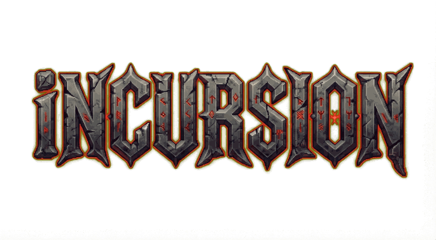
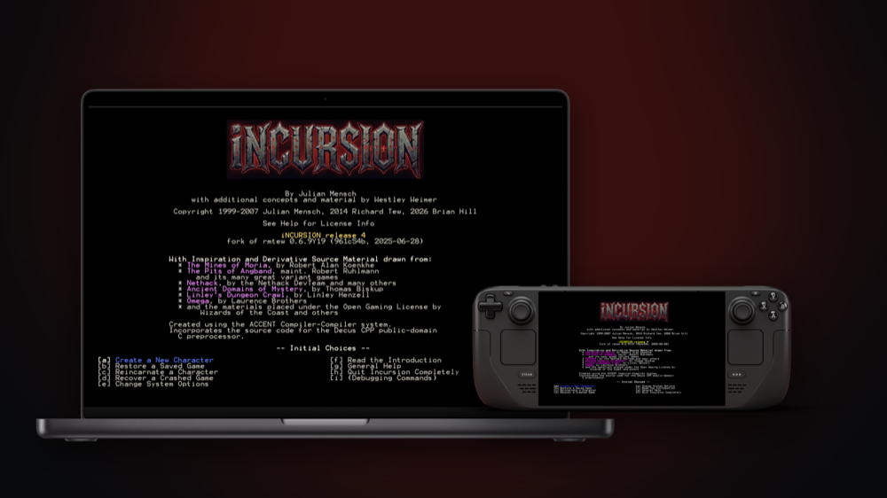
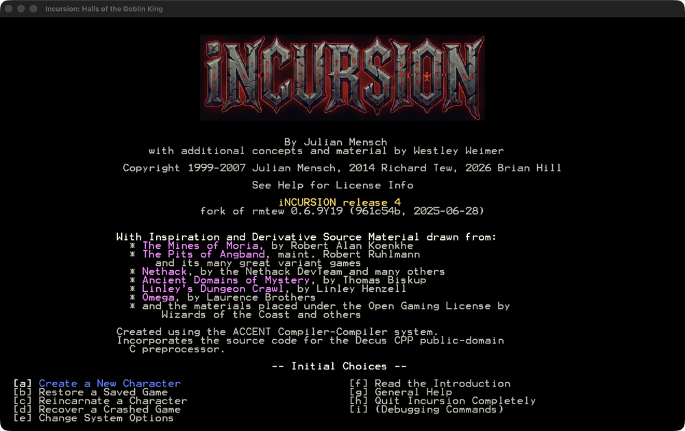
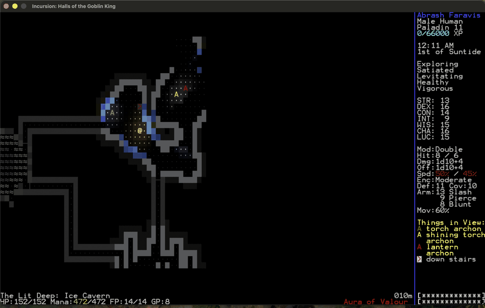
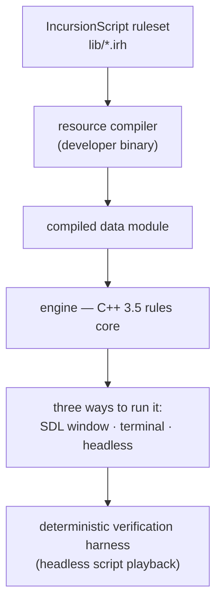

Julian Mensch's D&D 3.5 roguelike, running natively on macOS, Windows, Linux and
the Steam Deck.


Incursion is one of the deepest roguelikes ever written: a real, implemented 3.5
ruleset, with feats that combine, classes that branch into prestige paths, and a
tactical combat model that pays you back for every rule you know. Mensch even
threw out the SRD's eight schools of magic and wrote his own eleven.

It has only ever run on Windows. This fork brings it to macOS, Linux and the
Steam Deck, and in release 4 back to Windows. Four downloads, one commit, and it
is meant to be played, not built.




*Ninety seconds in the Lit Deep.* 

**Jump to:** [Get it](#get-it) · [What is new](#what-is-new) ·
[What is fixed](#what-is-fixed) · [What is next](#what-is-next) ·
[Build from source](#building-from-source) · [For developers](#for-developers)

---

## Get it

Download release 4 from the
[Releases](https://github.com/networkingguru/incursion-roguelike/releases) page.
Every download is built from the same commit.

| Download | For | State |
| --- | --- | --- |
| `incursion-macos-arm64.dmg` | macOS on Apple Silicon | Signed and notarised by Apple |
| `incursion-windows-x86_64.zip` | Windows 10 or later, x86-64 | New in release 4 |
| `incursion-steamdeck-x86_64.tar.gz` | SteamOS: the Steam Deck, or a handheld running it | Beta |
| `incursion-linux-x86_64.tar.gz` | Any other x86-64 Linux | Beta |

### macOS

Open the disk image, drag **Incursion.app** to Applications, and double-click it.

macOS asks once whether you want to open an app downloaded from the Internet.
That is normal. If it says *"the developer cannot be verified"* or *"the app has
been modified or damaged"*, something is wrong: please open an issue.



Requires Apple Silicon. Saves, options and logs live in
`~/Library/Application Support/Incursion/`, and deleting the app leaves them
alone.

### Windows

Unpack `incursion-windows-x86_64.zip` and run `Incursion.exe` from inside the
folder it makes. **Keep the folder together:** the game cannot start without the
files beside it. The executable is not signed yet, so SmartScreen warns you the
first time: choose *More info*, then *Run anyway*.

Requires Windows 10 or later on x86-64. Saves, options and logs stay in the
folder. This build has been played only in a Windows 11 ARM64 virtual machine,
under x86-64 emulation, so please open an issue for whatever you find.

### Linux and Steam Deck

**Both are a beta.** Expect bugs, and expect that a save may not survive the next
build. Both are Linux builds: a ROG Ally running the Windows it shipped with
wants the Windows download.

For **SteamOS** (the Steam Deck, or a handheld running SteamOS), switch to
Desktop mode and open Konsole. This bundle uses SteamOS's own SDL2, and it was
tested on a ROG Ally running SteamOS.

```
tar -xzf incursion-steamdeck-x86_64.tar.gz
cd incursion-deck && ./incursion.sh
```

`install-steamos.sh`, in the same folder, adds Incursion to Steam with a
controller layout, so you can start it from Game Mode with the pad mapped.

For **any other x86-64 Linux**, use the bundle that carries its own SDL2:

```
tar -xzf incursion-linux-x86_64.tar.gz
cd incursion-linux && ./run.sh
```

Requires x86-64 and glibc 2.31 or newer, which is the Debian 11 level. Start the
game through its script, not through the binary beside it. Saves, options and
logs stay in the folder.

---

## What playing it is like

You roll a character through a long, gloriously opinionated creation flow —
race, subrace, class, attributes, alignment, feats, skills, a god — and then you
go down into the Halls of the Goblin King. Combat is turn-based and genuinely
tactical. Positioning, attacks of opportunity, two-weapon fighting, spell
components and saving throws all matter, and the game will happily kill you for
ignoring any of them.

The writing is the other half of it. Every monster, item, spell and class carries
its own description inside the game — not a stat line, a paragraph with a voice.
You can read the entire ruleset from inside the game, and it is worth reading.

---

## What is new

**Release 4 is the first release where every download is the same program.**

- **The map is lit in colour.** Every torch, lantern, magma pool, glowing
  creature and light spell casts a coloured light that fades with distance and
  flickers. Light loses strength crossing ice or fog, and glints off a shiny wall.
- **Light decides what you can see, and what can see you.** You cannot hide while
  you carry a lit light.
- **The game plays on a gamepad**, so the Steam Deck needs no keyboard.
- **It runs on Windows again**, and on Linux and the Steam Deck.
- **A quieter colour palette**, chosen on the Options screen.
- **The Combat and Use menus show only what your character can do.**
- **More than twenty magic items now do what their own descriptions promise.**
- **Two deliberate rule changes:** every weapon a Paladin wields strikes as a holy
  weapon, and Monkey Grip one-hands a bastard sword.



**Your saves survive new content.** Since release 3, a save carries the name of
every piece of content it was written against, so a new monster or spell cannot
turn your orc into a lizardfolk. Coming from release 2? Upgrade through release 3 rather than skipping
it: release 3 converts the save, and a save that never passes through it will
read one resource off once later content is added.

The full notes for every release are in
[`docs/RELEASE-NOTES.md`](docs/RELEASE-NOTES.md).

---

## What is fixed

The engineering record is [`docs/FIXED.md`](docs/FIXED.md): every defect, how it
was verified, what was measured on each side, and the two claims that had to be
retracted.

| Area | What was wrong | Where |
| --- | --- | --- |
| Build | Four defects blocked any POSIX build from linking | [FIXED](docs/FIXED.md#the-four-defects-that-blocked-a-posix-build) |
| Saves | Narrowed typedefs overran the player's position and zeroed it in every save | [FIXED](docs/FIXED.md#the-four-defects-that-blocked-a-posix-build) |
| Saves | A failed save or a refused load could take the process with it | [FIXED](docs/FIXED.md#robustness-a-failure-should-not-take-the-process-with-it) |
| Crashes | Bottom-of-dungeon descent, self-deleting caster, inverted room rectangle | [FIXED](docs/FIXED.md#crashes-found-by-playing-and-by-the-harness) |
| Monster AI | Out-of-bounds map reads answered with the (0,0) square instead of failing | [FIXED](docs/FIXED.md#the-four-defects-that-blocked-a-posix-build) |
| Followers | Escorts read stack garbage as the handle of the creature to follow | [FIXED](docs/FIXED.md#found-by-the-game-playing-itself) |
| Rules | Racial feats, bare-handed attacks, sacrifice tables, natural weapon speed | [FIXED](docs/FIXED.md#rules-defects) |
| Rules | Magic items that did less than their own in-game descriptions promised | [FIXED](docs/FIXED.md#magic-item-descriptions-made-true) |
| Objects | The Item constructor read fields before assigning them and left others to the zero-fill, crashing a GCC `-O2` build | [FIXED](docs/FIXED.md#every-item-member-is-initialised) |
| Interface | Target cursor, store scrolling, overview-map staircase keys | [FIXED](docs/FIXED.md#interface-defects) |
| Packaging | Two defects that shipped and were reported by a stranger | [FIXED](docs/FIXED.md#two-defects-that-shipped-and-were-found-by-a-stranger) |
| Port artefacts | Six C escapes eaten by the port's path sweep; colliding run directories | [FIXED](docs/FIXED.md#defects-this-port-introduced-and-then-removed) |

Defects that belong to the base game rather than to this port are marked in the
source with an `upstream:` comment and listed in
[`docs/REPORTING-GATE.md`](docs/REPORTING-GATE.md), so they can be sent on. Four
have gone to the parent project and one is merged.

### Reading a save without loading the game

Point the game at a save file with `-dump` and it prints a full character report
to the terminal, then exits. Nothing is written. On macOS:

```
/Applications/Incursion.app/Contents/MacOS/Incursion -dump \
    ~/Library/Application\ Support/Incursion/save/YourCharacter.sav
```

The report gives hit points, position and depth, every equipped slot, every
effect on the character, the full inventory, and the complete character sheet.
Redirect it to a file to keep a snapshot.

---

## What is next

- **Give the Windows and Steam Deck downloads the confidence macOS has.** Only
  macOS has had a signed release behind it since release 1.
- **Sign the Windows executable**, so SmartScreen stops calling its publisher
  unrecognised.
- **Intel and universal Macs.**
- **Finish the content Mensch already wrote.** Eight races have subrace sections
  marked *(Unimplemented)* in the game's own help, and whole Fighter capstone feat
  trees carry the same label. A full read of `lib/` against the code found 480
  places where a description and its implementation disagree, and they are filed
  and being worked.
- **Play over ssh**, using the terminal build.
- **More than was shipped** — world mode, new dungeons — but only after the above.

---

## Building from source

You do not need this to play.

```
brew install sdl2 pkg-config
./build_macos.sh
./incursion
```

That takes about two minutes from a clean checkout. `BACKEND=posix ./build_macos.sh` builds the terminal and headless binary instead: it needs no
graphics, works over ssh, and can play the game from a script.

| To | Read |
| --- | --- |
| Cross-build `Incursion.exe` for Windows | [`docs/WINDOWS-BUILD.md`](docs/WINDOWS-BUILD.md) |
| Package, sign and notarise a macOS release | [`docs/RELEASING.md`](docs/RELEASING.md) |

---

## For developers

There is no test suite and no CI. There is a stated verification policy,
a harness that plays the game unattended, a regression gate, a set of checks
that each defend one defect, and a set of probe switches. Nearly all of it is new
in this fork.



| Question | Read |
| --- | --- |
| How a change is verified | [`docs/VERIFICATION.md`](docs/VERIFICATION.md) |
| The harness, the gate, every check and every probe switch | [`tools/README.md`](tools/README.md) |
| What was broken, and how each fix was verified | [`docs/FIXED.md`](docs/FIXED.md) |
| The running state of the port, and what is still open | [`docs/PORT-STATUS.md`](docs/PORT-STATUS.md) |
| A verdict on every instrument in the tree | [`docs/DEVTOOLS-AUDIT.md`](docs/DEVTOOLS-AUDIT.md) |
| What must be true before a claim goes public | [`docs/REPORTING-GATE.md`](docs/REPORTING-GATE.md) |
| How the engine fits together | [`docs/ENGINE-MAP.md`](docs/ENGINE-MAP.md) and its four companions |
| The scripting language the ruleset is written in | [`docs/incursionscript.md`](docs/incursionscript.md) |
| How the headless backend behaves | [`docs/HEADLESS-SPEC.md`](docs/HEADLESS-SPEC.md) |
| What each release changed | [`docs/RELEASE-NOTES.md`](docs/RELEASE-NOTES.md) |

Work is tracked in the repository with
[Beads](https://github.com/gastownhall/beads) — `bd ready` for what is available,
`bd show <id>` for one issue and its evidence.

---

## Credits

Incursion is **Julian Mensch's** work, with additional concepts and material by
**Westley Weimer**. It is a remarkable piece of design and a remarkable piece of
writing, and it deserves to be played on more than one operating system. That is
the entire reason this fork exists. Nothing here changes whose game it is.

- **Richard Tew** has maintained it since, and vendored the dependencies that
  make old builds reproducible. His
  [rmtew/incursion-roguelike](https://github.com/rmtew/incursion-roguelike)
  remains the parent project, and defects belonging to the base game are sent
  back there rather than kept here.
- **Kyle Benesch** (HexDecimal) did substantial modernisation work in 2024 —
  standard types, `std::min`/`max`, dead-code removal, CI. A sibling fork worth
  reading before writing anything new.
- **Eugene Archibald** found and fixed the registry load-failure defect that this
  fork carries as a hand-port. The fix and its evidence are his.

This fork is iNCURSION, forked from rmtew 0.6.9Y19 at commit `961c54b`
(2025-06-28).

## Links

- [Incursion website](http://incursion-roguelike.net)
- [RogueBasin page](http://www.roguebasin.com/index.php?title=Incursion)
- [Bay12 thread](http://bay12forums.com/smf/index.php?topic=139289) — the old
  discussion home

## Licence

See [LICENSE](LICENSE).